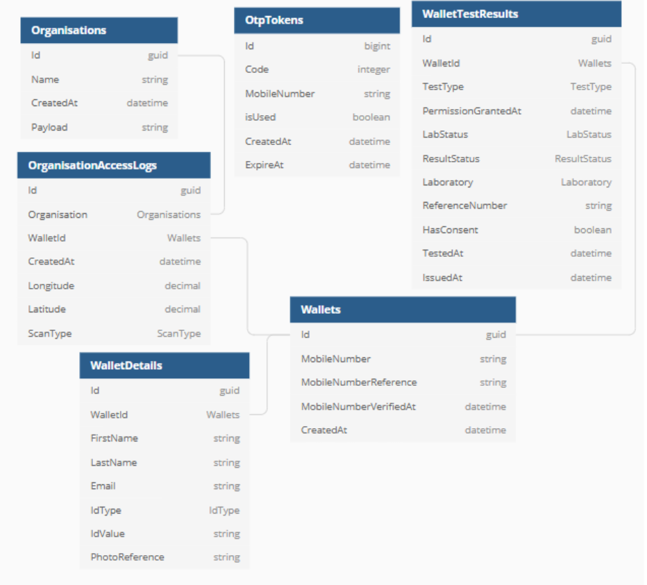
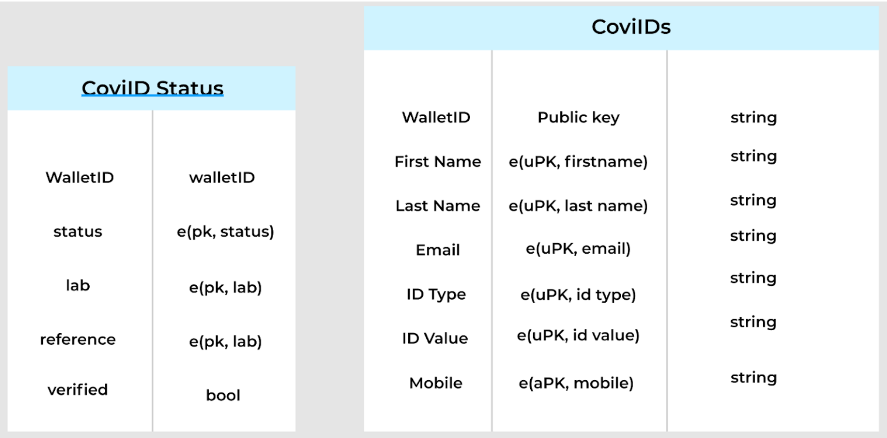
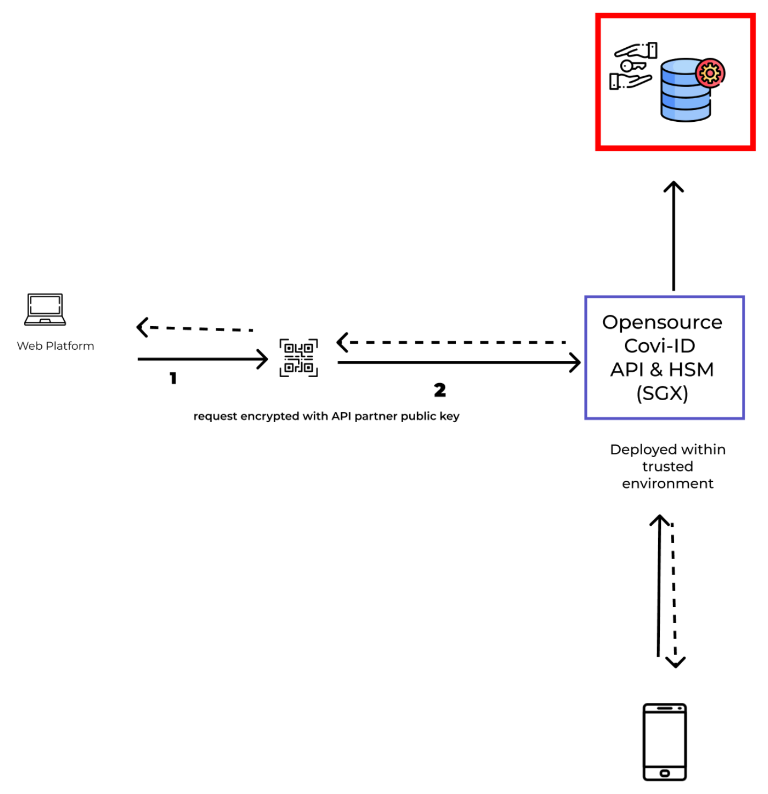
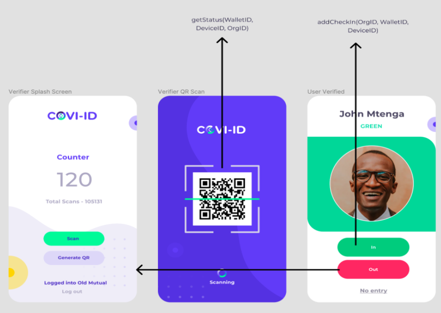

    

<h3>
    Covi-ID is an open source risk management tool designed to protect privacy.
</h3>

---

# Index

#### [Version Two](#version-two)
* [Version Two Features and Changes](#version-two-features-and-changes)
* [Migration](#migration)
#### [How Covi ID works](#how-covi-id-works)
* [DevOps](#devops)
    * [Database Design](#database-design)
    * [Architecture](#architecture)
    * [Data View](#data-view)
    * [QR Code Storage](#qr-code-storage)
#### [Sequence Diagrams](#sequence-diagrams)
* [User Generates non SSI Wallet](#user-generates-non-ssi-wallet)
* [User Adds Test Results](#user-adds-test-results)
* [User Check In](#user-check-in)
* [User Check Out](#user-check-out)
* [User Cancels Check In](#user-cancels-check-in)
#### [Going Forward](#going-forward)

The implementation repositories can be found here:
#### [> `API Core`](https://github.com/covi-id/cid-api-core) 
#### [> `Web App`](https://github.com/covi-id/cid-web-app)
#### [> `Mobile App`](https://github.com/covi-id/cid-mob-app)

---

    

# Version Two

## Version Two Features and Changes

* The system architecture will be modified so that the user identities (Wallet ID’s) created and their associated data will be stored in the Covi ID servers and database (existing user information on StreetCred will need to be imported into Covi ID servers accordingly - this will occur in the next sprint).
    * The generation of the UUID occurs when the Covi ID (Wallet ID) is written to the database as the database possesses built-in capabilities to generate the UUID when writing new records to the table. 
* User identities will now be created with the generation of a secret key. Symmetric cryptography was employed. Advanced Encryption Standard was used. 
* Privacy-preserving techniques are employed to protect user data. User data will be stored in an encrypted manner using the secret key.
* This key is stored in the users QR Code along with their Wallet ID.
* User data cannot be decrypted without the secret key and even when decrypted, this is only done in a raw state of transit and this key is never stored by Covi ID’s servers. The state of transit is required for the Covi ID API to pull the users status and return it to the verifier. 
 
It is important to note that despite moving away from the StreetCred SSI management system, the concept of SSI still remains as encryption techniques have been employed. 

## Migration

It has been determined that the existing code-base from Covi-ID Version 1.0 will be modified and adjusted accordingly. A new code base was not created. 

In terms of the encryption, the code relating to it will be segmented within the code-base making any modification to any encryption aspects easily accessible without upsetting the entire code structure. To begin with, all data will be encrypted at a base level.

---

# How Covi ID Works

## DevOps

### Database Design
Below is the data base laid out in relational tables. 

    

Description needed @Delta

    

### Architecture
Below is the architecture diagram of the Coi ID system. 

    

### Data View
Who can see the data in plain text and when

    

### QR Code Storage
The user’s identity and their secret key are stored within their QR Code. Additionally, a reference to the user’s picture is stored. This reference is then encrypted by S3 and given a limited time access URL where the picture can be accessed for 3 minutes. This reference is in the form of a GUID so no reference to the users identity is made in the filename. 

The user’s secret key is generated by using a random byte array provided by the RNGCryptoServicProvider. This secret key is then encrypted using the ServerKey.  To better understand the process, please see the flow below:

* The user will go to the web platform
* The user will enter their details and submit them.
* A wallet is created for the user with the users mobile number attached to it.
* An OTP is generated and sent to the user.
* OTP is linked to the Wallet via a token (until verified and returned)
* User enters their OTP and submits
* The OTP token is now in the header of the request and the request and the rest of the user details (firstname, lastname, etc) are in the body of the request.
* OTP gets verified
* Secret key for the user is created (WalletID + CoviID Server Secret Key = User Secret Key)
* Details from the request are encrypted by the user’s secret key.
* Wallet and Secret key are returned to the user.
* Wallet and Secret key are encoded into a QR Code. 

Therefore, this changes the expectations on the app as the app now needs to know how to construct. 

* The URL to check the COVID-19 health status for that user
* The URL to check-in
* The URL to check-out

### Organisation endpoints

Please see the end point documentation here. 

---

# Sequence Diagrams

Key:
sK: Secret Key. Encrypts user data in a way we can’t access.
aK: Application Key. Encrypts mobile number and sK in a way that the server can decrypt.

## User Generates non SSI Wallet

    

## User Adds Test Results
* A user can attest to test results. In order to do this, they need to provide their secret key.
* If a user has tested positive, send their location data to SafePlaces

    

## User Check In
* The user currently is “checked in” to the organisation and is “counted” regardless of whether the verifier actually indicates that the user has been allowed to enter based on the status returned. We need to split the “status check” and the “add check in” logic as the verifier may reject the entrance of a user. Currently, it “checks everyone in” regardless. 
* The app will need to be amended to allow for this split in functionality. So after scanning, the verifier needs to be able to confirm or deny entry. 
* If the user is not approved for entry, we still need a record of them being there. 
* Need to add logic to check if that PK has entered the building that day, if they have can only check out - check-in button disabled 
Response must return counter 

    

Below is the sequence diagram for this process:

    

## User Check Out

## User Cancels Check In

---

# Going Forward

