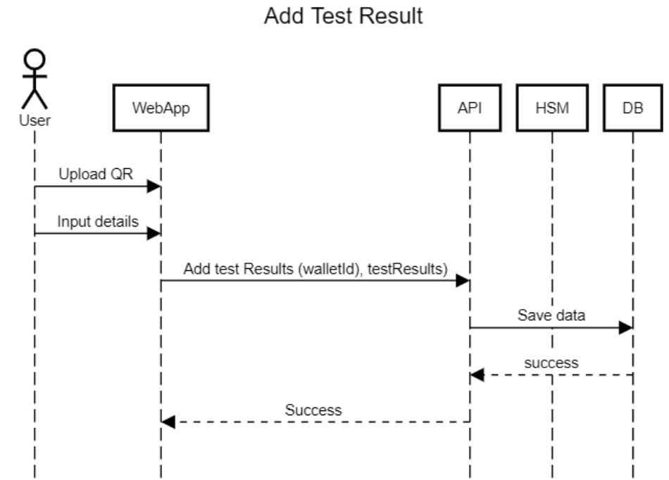
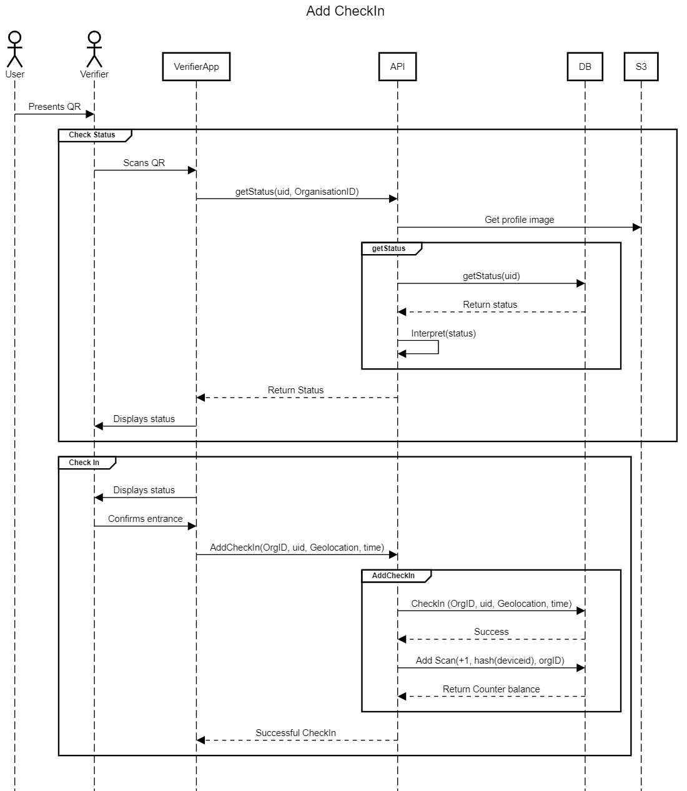

    

<h3>
    Covi-ID is an open source risk management tool designed to protect privacy.
</h3>

---

# Index

#### [Version Two](#version-two)
* [Version Two Features and Changes](#version-two-features-and-changes)
* [Migration](#migration)
#### [How Covi ID works](#how-covi-id-works)
* [DevOps](#devops)
    * [Database Design](#database-design)
    * [Architecture](#architecture)
    * [Data View](#data-view)
    * [QR Code Storage](#qr-code-storage)
    * [Organisation Endpoints](#organisation-endpoints)
* [Status Logic](#status-logic)
#### [Sequence Diagrams](#sequence-diagrams)
* [User Generates non SSI Wallet](#user-generates-non-ssi-wallet)
* [User Adds Test Results](#user-adds-test-results)
* [User Check In](#user-check-in)
* [User Check Out](#user-check-out)
* [User Cancels Check In](#user-cancels-check-in)
#### [Going Forward](#going-forward)

The implementation repositories can be found here:
#### [> `API Core`](https://github.com/covi-id/cid-api-core) 
#### [> `Web App`](https://github.com/covi-id/cid-web-app)
#### [> `Mobile App`](https://github.com/covi-id/cid-mob-app)

Additional documentation
#### [> `End Points Documentation`](https://github.com/covi-id/cid-documentation/blob/master/end_points.md)

---

    

# Introduction

## Problem

As countries attempt to kickstart their economy in the wake of the COVID-19 crisis, it is vital that efficient measures are in place to contain future outbreaks of the virus. Businesses are looking for ways to protect their employees and customers, and to enable disease surveillance, ultimately preventing the spread of infection.

Businesses currently struggle with:
* Fulfilling corporate responsibilities to protect their employees and staff.
* Implementing efficient track and trace solutions, which are often time consuming and costly.

## Solution

Covi-ID offers an easy-to-use mobile verifier app that provides businesses with a simple, and free way to fulfil their responsibility to society during COVID times. This takes the shape of a simple system that can:
* Enable contact tracing by capturing “check-ins” and “check-outs” related to an organisation's geolocation.
* By partnering with third parties such as SafePlaces, customers/employees can be notified if they have been exposed to a confirmed COVID-19 case, giving them extra peace of mind without creating additional cost for the business.

## Composition

The Covi-ID solution is made up of two components:
* Covi-ID Web application (platform) - provides the ability for users to easily generate their personal Covi-ID which acts as their personal data wallet.
* Covi-ID Mobile app - enables organisations to monitor the flow of individuals on their premises and enable a contact tracing mechanism for their employees and clients. Currently only available on Android, iStore distribution pending review. 

## Benefits of Covi-ID

* Individuals can easily generate QR codes from the Covi-ID web application.
* Verifiers can scan an individual's QR code using the Covi-ID verifier app to “check-in” or “check-out” of their premises.
* Whenever a verifier scans the QR code of an individual, the verifier leaves a token with a geolocation and time stamp in the individual’s personal data wallet.
* Covi-ID uses the latest privacy-preserving technology to support manual track and trace solutions.
* Individuals who test positive for COVID-19 can volunteer to submit their data to the SafePlaces application, which creates a real-time map of COVID-19 hotspots across South Africa.

## Data

---

# Functionality Overview

## Data Flow
The system is designed to protect the privacy of users who contribute location check in data. The core privacy preserving capabilities are enabled by the use of a Trusted Execution Environment (TEE), which encrypts data using a private-public keypair, in both transit and at rest This enables the Covi-ID system to render the database operator unable to read the database contents, a core requirement of returning true data ownership and privacy back to the data owner.

This privacy preserving TEE architecture forms the core of all data flows within the system, as detailed below.

---

## Sequence Diagrams

Key:
sK: Secret Key. Encrypts user data in a way we can’t access.
aK: Application Key. Encrypts mobile number and sK in a way that the server can decrypt.

### User Generates non SSI Wallet

    

### User Adds Test Results
* A user can attest to test results. In order to do this, they need to provide their secret key.
* If a user has tested positive, send their location data to SafePlaces

    

### User Check In
* The user currently is “checked in” to the organisation and is “counted” regardless of whether the verifier actually indicates that the user has been allowed to enter based on the status returned. We need to split the “status check” and the “add check in” logic as the verifier may reject the entrance of a user. Currently, it “checks everyone in” regardless. 
* The app will need to be amended to allow for this split in functionality. So after scanning, the verifier needs to be able to confirm or deny entry. 
* If the user is not approved for entry, we still need a record of them being there. 
* Need to add logic to check if that PK has entered the building that day, if they have can only check out - check-in button disabled 
Response must return counter 

    

Below is the sequence diagram for this process:

    

### User Check Out
Prior to this sprint, verifiers would simply “subtract” from the balance. This would not issue a credential which would enable us to detect the times between which a user has been in a particular location. This will be important when it comes to contact tracing. The differences to check in are:
* Record added to the database is negative
* No need to check status first

    

Below is the sequence diagram for this process:

    

### User Cancels Check In
The status is checked, but the counter for that location is not updated.

    

---

# Going Forward
The next version Covi-ID platform has been built to include a secure enclave implementation that act as a Trusted Execution Environment (TEE). Details around this implementation can be found here.

The current version of the Covi-ID platform will thus be deprecated but details regarding this implementation can be found here.

The next sprint will involve three key aspects: 

* **Trusted Execution Environment (TEE):** TEE’s are isolated areas in a device that is separate from the main operating system where applications and data can reside. Applications that sit within the TEE, such as Covi ID, are referred to as trust applications. The key aspects of TEE’s are the guarantees of security, confidentiality and integrity in relation to sensitive information. The data of these trusted applications are cryptographically secured, stored and processed. 
* **HSM and enclave encryption techniques:** This will provide an additional layer of security to the already secure structure which employs symmetric cryptography. 
* **Streetcred Export:** Importing all previously created identities in Version 1.0 from Streetcred into the Covi ID servers and database. 