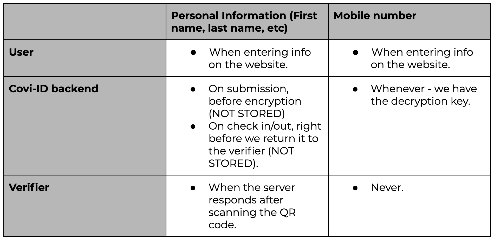
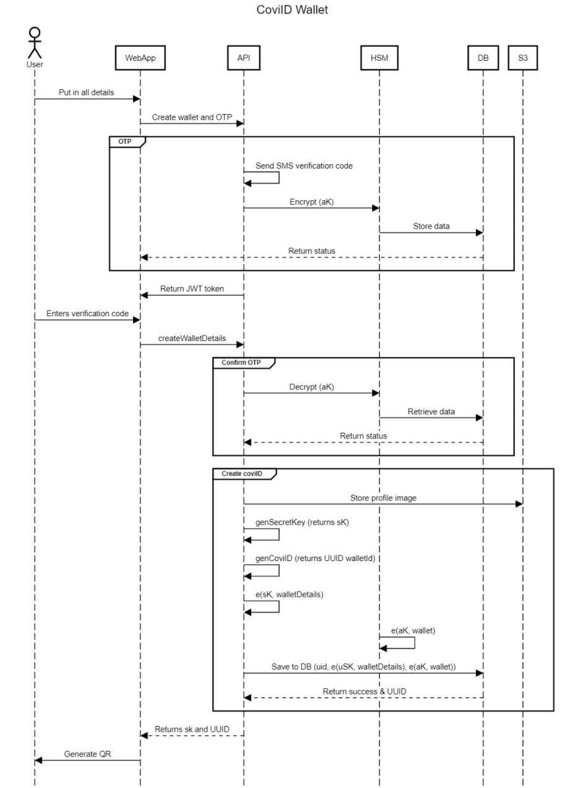
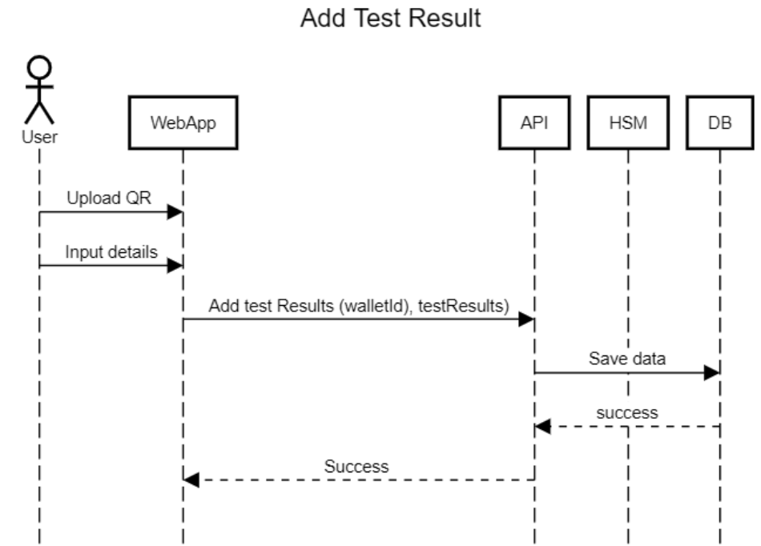
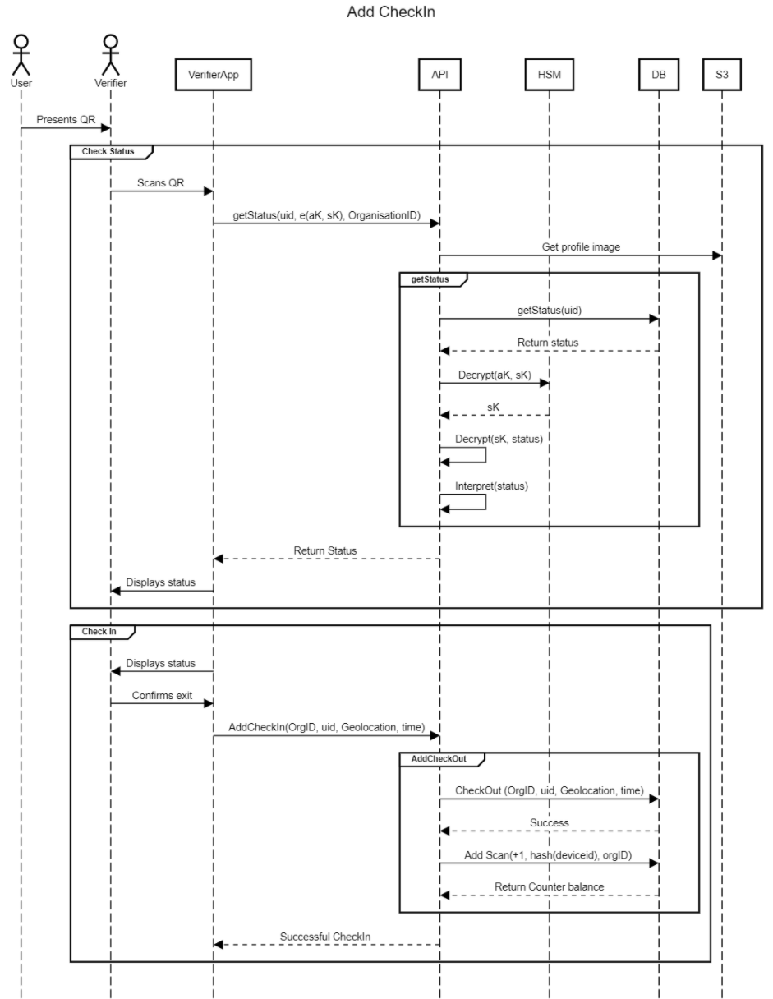
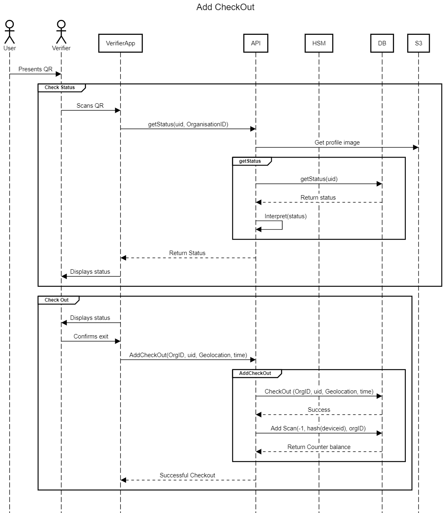
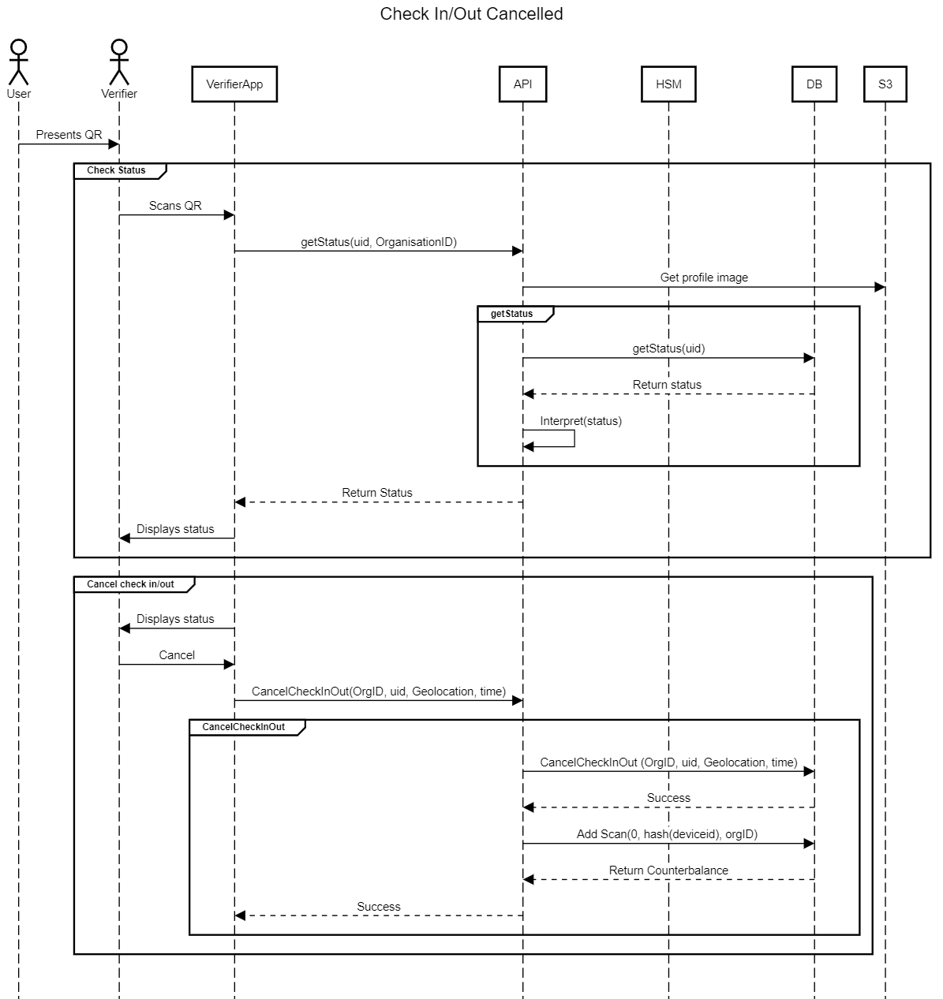
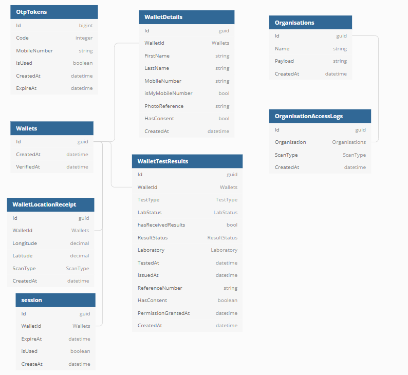

<div align="center">
    
</div>
<h1>
    CoviID .Net Core API Documentation
</h1>
<h3>
    Covi-ID is an open source risk management tool designed to protect privacy.
</h3>

The following document contains details about the REST API that is hosted on AWS. The code for this API can be found [here](https://github.com/covi-id/cid-api-core)

---

# Index

* [Data View](#Data-View)

  * [User Data](#User-Data)
  * [QR Code Data](#QR-Code-Data)

* [Sequence Diagrams](#Sequence-Diagrams)
* [Database Design](#Database-Design)
* [Endpoints](#End-points)

---

# Data View

## User Data

The table below shows when data is in plain text and when the data is encrypted.

<div align="center">
    
</div>

## QR Code Data

The user’s identity and their secret key are stored within their QR Code. Additionally, a reference to the user’s picture is stored. This reference is then encrypted by S3 and given a limited time access URL. This reference is in the form of a GUID so no reference to the users identity is made in the filename.

The user’s secret key is generated by using a random byte array provided by the RNGCryptoServicProvider. This secret key is then encrypted using the ServerKey. To better understand the process, please see the flow below:

* The user will go to the web platform
* The user will enter their details and submit them.
* A wallet is created for the user with the users mobile number attached to it.
* An OTP is generated and sent to the user.
* OTP is linked to the Wallet via a token (until verified and returned)
* User enters their OTP and submits
* The OTP token is now in the header of the request and the request and the rest of the user details (firstname, lastname, etc) are in the body of the request.
* OTP gets verified
* Secret key for the user is created (WalletID + Covi ID Server Secret Key = User Secret Key)
* Details from the request are encrypted by the user’s secret key.
* Wallet and Secret key are returned to the user.
* Wallet and Secret key are encoded into a QR Code.

Therefore, this changes the expectations on the app as the app now needs to know how to construct.

* The URL to check the COVID-19 health status for that user
* The URL to check-in
* The URL to check-out

# Sequence Diagrams

Keys:

* sK: Secret Key. Encrypts user data in a way we can’t access.
* aK: Application Key. Encrypts mobile number and sK in a way that the server can decrypt.

## User Generates non SSI Wallet

Below is the sequence diagram for this a user creating a wallet:

<div align="center">
    
</div>

## User Adds Test Results

* A user can attest to test results. In order to do this, they need to provide their secret key.
* If a user has tested positive, send their location data to SafePlaces

<div align="center">
    
</div>

## User Check In

Below is the sequence diagram for a user checking in to an organisation:

<div align="center">
    
</div>

## User Check Out

Below is the sequence diagram for a user checking out of an organisation:

<div align="center">
    
</div>

## User Cancels Check In

The status is checked, but the counter for that location is not updated. The canceled entry is still recorded.

<div align="center">
    
</div>

---

# Database Design

<div align="center">
    
</div>

The source code for the database design can be seen below. This source code can be used with an app like [Dbdiagrams](https://dbdiagrams.io).

```
table OtpTokens
{
  Id bigint
  Code integer 
  MobileNumber string [note: 'serverPk']
  isUsed boolean
  CreatedAt datetime
  ExpireAt datetime
}

table Organisations
{
  Id guid
  Name string
  Payload string 
  CreatedAt datetime
}

table OrganisationAccessLogs
{
  Id guid
  Organisation Organisations [ref: > Organisations.Id]
  ScanType ScanType
  CreatedAt datetime
}

table Wallets
{
  Id guid
  CreatedAt datetime
  VerifiedAt datetime
}

table WalletDetails
{
  Id guid
  WalletId Wallets [ref: > Wallets.Id]
  FirstName string  [note: 'serverPk, userPK']
  LastName string [note: 'serverPk, userPK']
  MobileNumber string [note: 'serverPk']
  isMyMobileNumber bool 
  PhotoReference string  [note: 'serverPk, userPK']
  HasConsent bool
  CreatedAt datetime
}

table WalletTestResults
{
  Id guid
  WalletId Wallets [ref: > Wallets.Id]
  TestType TestType
  LabStatus LabStatus
  hasReceivedResults bool
  ResultStatus ResultStatus
  Laboratory Laboratory
  TestedAt datetime
  IssuedAt datetime 
  ReferenceNumber string  [note: 'serverPk, userPK']
  HasConsent boolean
  PermissionGrantedAt datetime
  CreatedAt datetime
}

table WalletLocationReceipt
{
  Id guid
  WalletId Wallets [ref: > Wallets.Id]
  Longitude decimal 
  Latitude decimal 
  ScanType ScanType 
  CreatedAt datetime 
}

table session
{
  Id guid
  WalletId Wallets [ref: > Wallets.Id]
  ExpireAt datetime
  isUsed boolean
  CreateAt datetime
}

enum ScanType
{
  CheckIn
  CheckOut
  Denied
}

enum Laboratory
{
  NHLS
  Lancet
  Pathcare
}

enum LaboratoryStatus
{
  Unsent
  InProgress
  Verified
}

enum ResultStatus
{
  Untested
  Negative
  Positive
}

enum TestType
{
   Covid19
}
```

# End-points 

The end-points for this API are implemented in a RESTful standard and a detailed file can be found [here](https://github.com/covi-id/cid-documentation/blob/master/end_points.md).